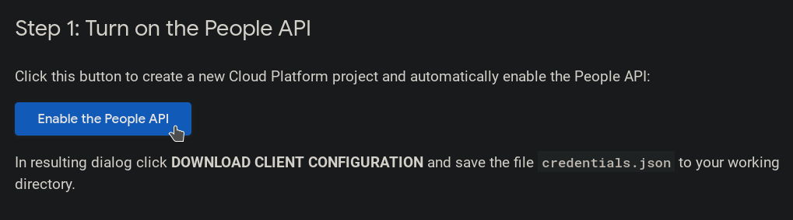

# USTH Calendar Scraping

### What the hell is this
Tired of searching through multiple USTH calendars to find what is your best friend studying in his class? Don't worry! With the ultimate **USTH Calendar Scraping**, you, don't have to worry about clicking through boring stuffs.

### What you need first
In order to use this, you need a *credentials.json* file and **Python3.x**. To obtain *credentials.json*, you could go to this page: <ins>https://developers.google.com/people/quickstart/python</ins>.



And just do step one to get the *credentials.json* file. Be sure to put that file in the same directory of our Python codes =).

You think it is done? Not so fast! Install these Python libraries first by running:
```
pip install --upgrade bs4 google-api-python-client google-auth-httplib2 google-auth-oauthlib
```

If it does not work, please try 

```
python -m pip
```

instead of 

```
pip
```

### Usage
**Wanna get it fast?** Here is how you do it!

*Linux, and anywhere else?*

```
python get_link_calendar.py && python extract_from_calendar.py 30 > output.csv 
```

<ins>*Note:*</ins> *Basically, this code snippet will produce an output file in CSV format, at output.csv.*

*Actual syntax*
```
python get_link_calendar.py && python extract_from_calendar.py {nUpcoming} > {output-filename}.csv
```

where *nUpcoming* is the number from 0-infinity of future events you want to get in the calendar. </br> 
and *output-filename* is the output file you desire.

You could set them to any value if you want. Seriously! Just don't tell me why the hell is the code taking so slow or why your computer is trying to cry out loud...

### What the hell am I seeing here in this f**king CSV file?
Well, the data you collect is in the following format:
```
| Name of the subject   |                       |                       |                       |                       |                       |
|                       | Start Time 1          | End Time 1            | I forgot 1            | Location 1            | Description 1         |
|                       | Start Time 2          | End Time 2            | I forgot 2            | Location 2            | Description 2         |
|                       | Start Time 3          | End Time 3            | I forgot 3            | Location 3            | Description 3         |
```
